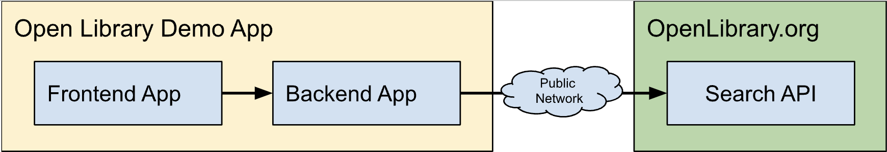
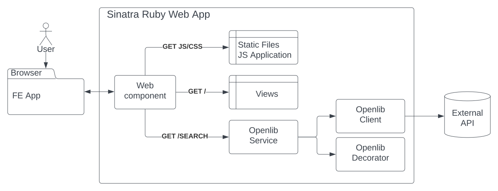
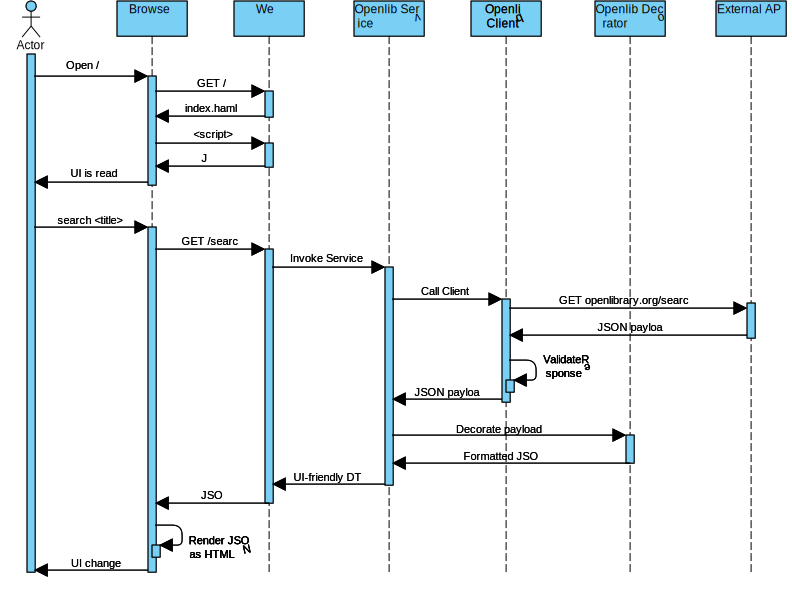

# Overview
This is a Web application allowing users to search for a book by title.

# Requirements
The system should provide the following abilities
* To utilize Open Library's Search API by a book title
* To display the Top 10 most relevant results including title and author information
* To open Open Library's book details for each found book

## High-Level Design
The system consists of the backend Sinatra application and frontend JavaScript applications.

## Component Design
The Backend Components include
* Web component - providing routing and static assets server
* Openlib Service, Client, and Decorator to retrieve, validate, and format data. See the sequence diagram below for more information

The FE component is a plain vanilla JavaScript application served as a static asset. Bundling and browser compatibility is out of the scope of the project. Basic styling is performed using Bootstrap CSS. The search HTML input initiates an async BE request and displays the results using client-side rendering.

## Sequence Diagram
The primary use case is
1. Open the application, https://openlib-demo.herokuapp.com/
2. Type the desired search query and hit Enter or the Search button
3. Inspect the search results or error messages if any

